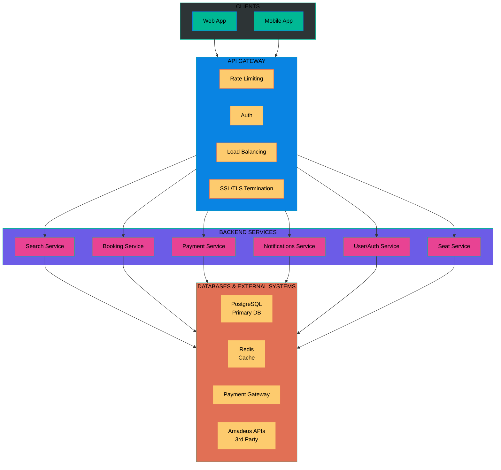

# System Design & Architecture

## Flight Booking Backend with FastAPI

## Functional Requirements

| # | Feature | Description |
| --- | ------------------- | ----------------------------------------------------------------------------- |
| 1 | Search Flight | Users can search for available flights by route, date, and passenger count. |
| 2 | View Flight Details | Users can view full details of a specific flight including pricing and stops. |
| 3 | User Authentication | Users can register, log in, and access protected endpoints via JWT tokens. |
| 4 | Ticket Issuance | System generates and assigns a unique ticket upon successful booking. |
| 5 | Seat Selection | Users can choose or change their preferred seat before checkout. |
| 6 | Booking History | Users can view all past and upcoming bookings linked to their account. |
| 7 | Payment | Users can complete payments securely via integrated payment providers. |
| 8 | Cancel Flight | Users can cancel a booking and receive applicable refunds. |

---

## Non-Functional Requirements

| # | Requirement | Description |
| --- | ----------------- | ------------------------------------------------------------------------------ |
| 1 | High Availability | System stays operational with minimal downtime using redundant infrastructure. |
| 2 | Scalability | Architecture handles millions of concurrent users through horizontal scaling. |
| 3 | Low Latency | API responses remain fast (<200ms) via caching and optimized queries. |
| 4 | Consistency | Booking data stays accurate and synchronized across all services. |
| 5 | Resilience | System recovers gracefully from failures using retries and circuit breakers. |
| 6 | Data Integrity | All transactions follow ACID guarantees to prevent duplicate or lost bookings. |

---

## High-Level Architecture

### Architecture Layers

| Layer | Components | Purpose |
| ------------------------ | -------------------------------------------------------- | --------------------------------------------- |
| **Client** | Web App, Mobile App | User interface for end users |
| **API Gateway** | Rate limiting, Auth, Load balancing, SSL/TLS | Single entry point, security, traffic mgmt |
| **Backend Services** | Search, Booking, Payment, Notifications, User/Auth, Seat | Core business logic (microservices) |
| **Databases / External** | PostgreSQL, Redis, Payment Gateway, Amadeus APIs | Data storage, caching, 3rd party integrations |

---

> **Status:** This document outlines the initial brief. Architecture details (tech stack, API design, data models) to be expanded.
