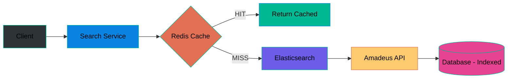
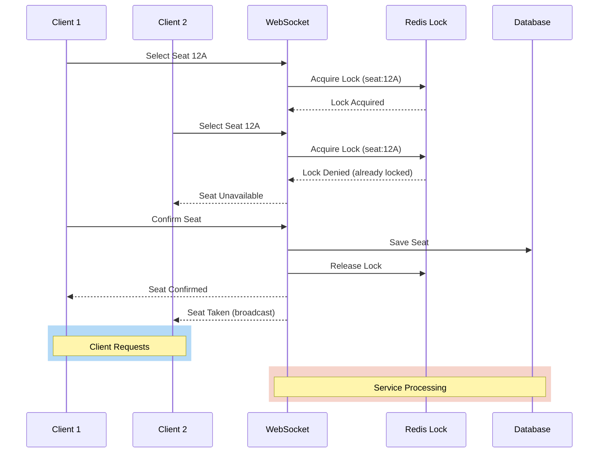
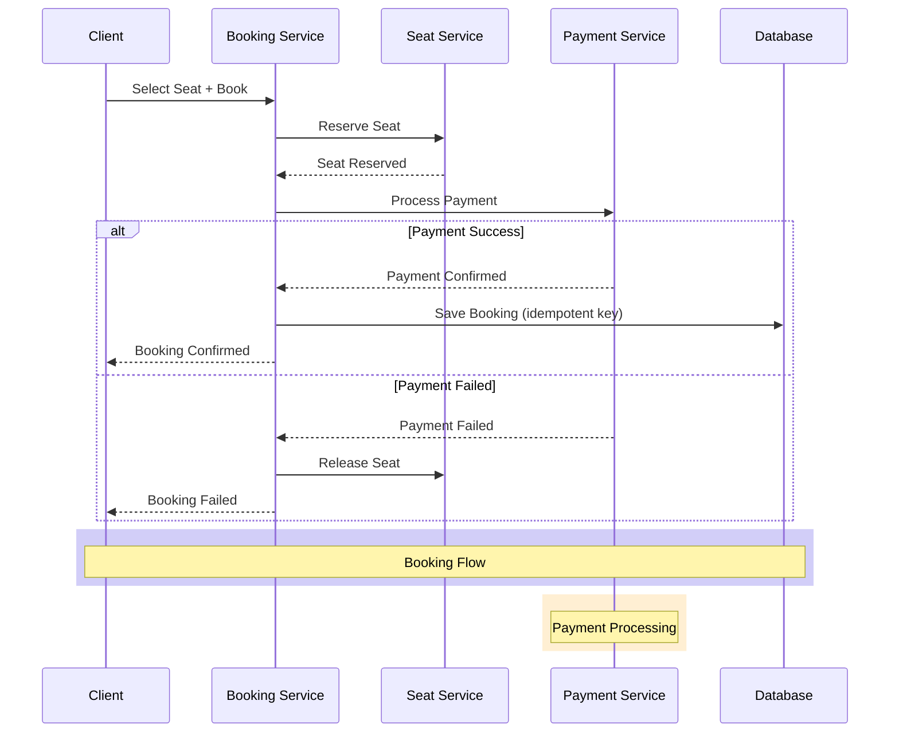
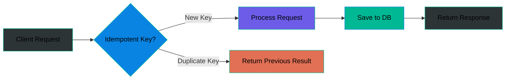
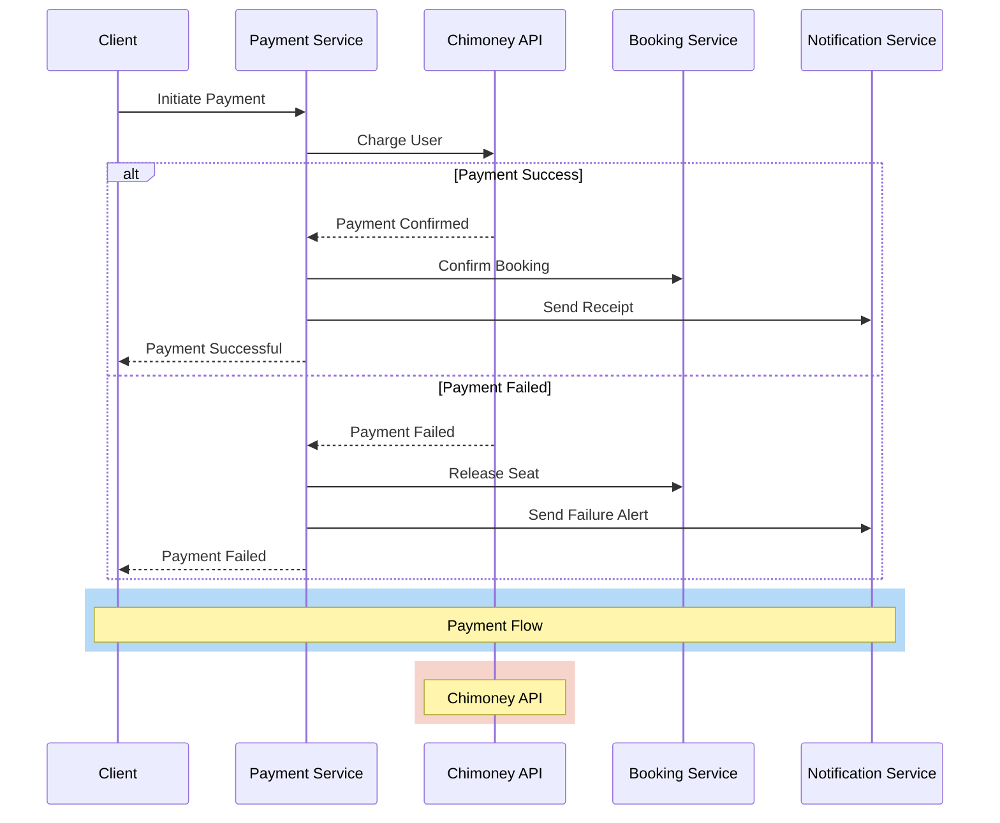
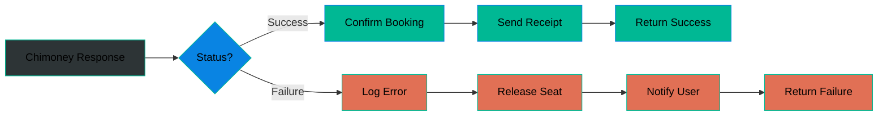
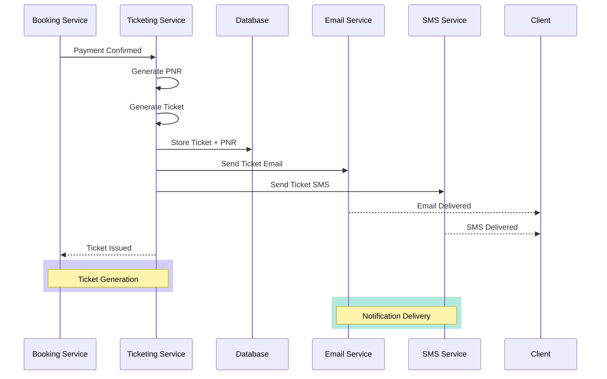
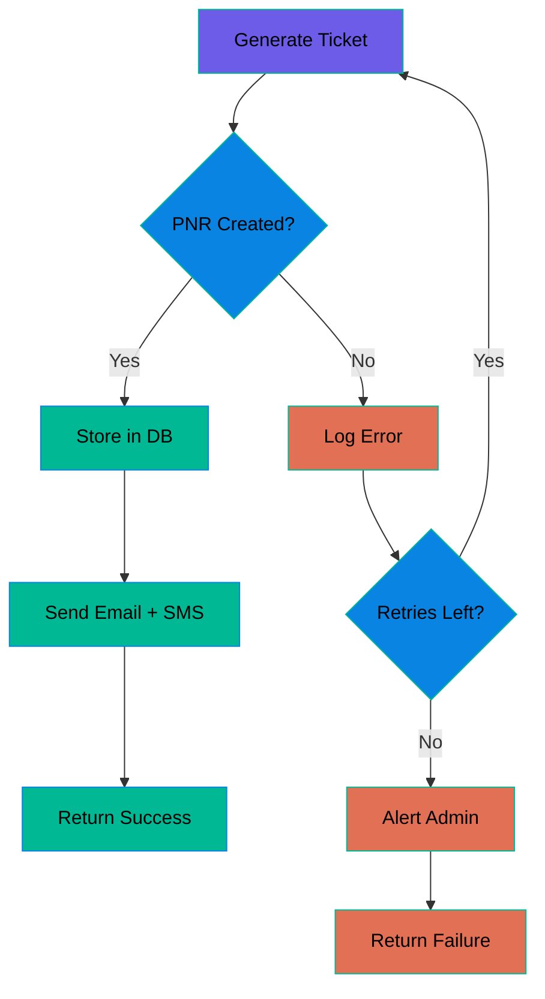

# Component Design

### 1. Search Service

**Responsibility:** Handle flight search queries and return available flights.

| Component | Description |
| --------------- | --------------------------------------------------------- |
| Debounce Layer | Prevents excessive API calls from rapid user inputs |
| Cache (Redis) | Caches frequent search results to reduce Amadeus calls |
| Elasticsearch | Full-text search for flights, airports, and routes |
| Amadeus Adapter | Fetches live flight data from Amadeus Self-Service APIs |
| DB (Indexed) | PostgreSQL with indexed columns for fast search queries |

#### Data Flow

---

### 2. Seat Management Service

**Responsibility:** Manage seat selection, availability, and concurrency control.

| Component | Description |
| ---------------- | ------------------------------------------------- |
| WebSocket | Real-time seat updates to all connected clients |
| Redis Locks | Distributed locks to prevent double-booking |
| Concurrency Ctrl | Ensures only one user can select a seat at a time |
| DB (Indexed) | PostgreSQL with indexed seat/flight columns |

#### Concurrency Flow

---

### 3. Booking Service

**Responsibility:** Manage the full booking flow from seat selection to payment to confirmation.

| Component | Description |
| ----------------- | ------------------------------------------------------------- |
| Idempotent API | Prevents duplicate bookings from retry attempts |
| Retry Logic | Automatically retries failed requests with exponential backoff |
| Payment Processor | Handles payment verification before confirming booking |
| DB (Transactional) | Ensures atomicity across booking, seat, and payment records |

#### Booking Flow

#### Idempotency Flow

---

### 4. Payment Service

**Responsibility:** Process payments via Chimoney API and handle success/failure.

| Component | Description |
| ------------------- | ------------------------------------------------------- |
| Chimoney Adapter | Integrates with Chimoney API for payment processing |
| Success Handler | Confirms payment and triggers booking confirmation |
| Failure Handler | Logs error, notifies user, and triggers seat release |
| Retry Logic | Retries failed API calls with exponential backoff |

#### Payment Flow

#### Success/Failure Handling

---

### 5. Ticketing Service

**Responsibility:** Generate, store tickets with PNR and send email/SMS notifications.

| Component | Description |
| ----------------- | ------------------------------------------------------- |
| Ticket Generator | Creates unique ticket with PNR linked to flight booking |
| PNR Manager | Manages Passenger Name Record for flight check-in |
| Email Service | Sends ticket and booking confirmation via email |
| SMS Service | Sends ticket and booking confirmation via SMS |

#### Ticket Flow

#### PNR Structure

| Field | Description |
| ----------- | ----------------------------------------- |
| PNR Code | 6-character unique booking reference |
| Flight Info | Flight number, route, date, time |
| Passenger Info | Name, contact, passport details |
| Seat Number | Assigned seat (e.g. 12A) |
| Booking Status | Confirmed / Pending / Cancelled |

#### Success/Failure Handling

---

> **Status:** Search, Seat Management, Booking, Payment, and Ticketing services detailed. Other services to be added.
