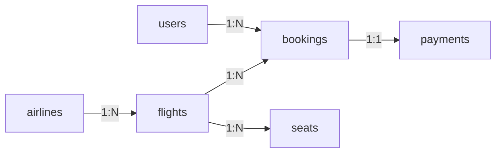
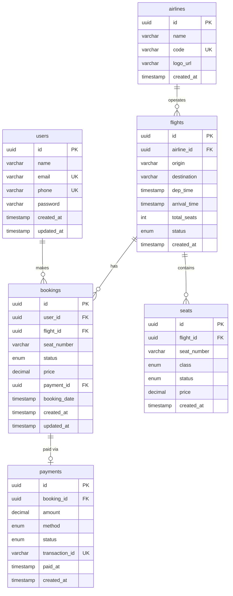

# Flight Booking System - Database Design

## Overview

This document outlines the database design for a flight booking system that manages users, flights, bookings, payments, and seat availability.

---

## Tables

### 1. users

Stores user account information.

| Column | Type | Constraints | Description |
|--------|------|-------------|-------------|
| id | UUID / BIGINT | PRIMARY KEY | Unique identifier |
| name | VARCHAR(100) | NOT NULL | Full name |
| email | VARCHAR(255) | UNIQUE, NOT NULL | Email address |
| phone | VARCHAR(20) | UNIQUE, NOT NULL | Phone number |
| password | VARCHAR(255) | NOT NULL | Hashed password |
| created_at | TIMESTAMP | DEFAULT NOW() | Account creation time |
| updated_at | TIMESTAMP | DEFAULT NOW() | Last update time |

**Indexes:**
- `idx_users_email` on (email) - UNIQUE
- `idx_users_phone` on (phone) - UNIQUE

---

### 2. flights

Stores flight information.

| Column | Type | Constraints | Description |
|--------|------|-------------|-------------|
| id | UUID / BIGINT | PRIMARY KEY | Unique identifier |
| airline_id | UUID / BIGINT | FOREIGN KEY → airlines(id) | Airline reference |
| origin | VARCHAR(3) | NOT NULL | Origin airport code (IATA) |
| destination | VARCHAR(3) | NOT NULL | Destination airport code (IATA) |
| dep_time | TIMESTAMP | NOT NULL | Departure time |
| arrival_time | TIMESTAMP | NOT NULL | Arrival time |
| total_seats | INT | NOT NULL | Total available seats |
| status | ENUM | NOT NULL | 'scheduled', 'delayed', 'cancelled', 'completed' |
| created_at | TIMESTAMP | DEFAULT NOW() | Record creation time |

**Indexes:**
- `idx_flights_origin_dest` on (origin, destination) - Composite index for route searches
- `idx_flights_dep_time` on (dep_time) - For date-based searches
- `idx_flights_status` on (status) - For filtering active flights

**Partitioning:**
- Partition by `dep_time` (range partitioning by month/quarter) for historical data management

---

### 3. bookings

Stores booking/reservation records.

| Column | Type | Constraints | Description |
|--------|------|-------------|-------------|
| id | UUID / BIGINT | PRIMARY KEY | Unique identifier |
| user_id | UUID / BIGINT | FOREIGN KEY → users(id) | User who made booking |
| flight_id | UUID / BIGINT | FOREIGN KEY → flights(id) | Booked flight |
| seat_number | VARCHAR(5) | NOT NULL | Assigned seat |
| status | ENUM | NOT NULL | 'pending', 'confirmed', 'cancelled', 'completed' |
| price | DECIMAL(10,2) | NOT NULL | Total price |
| payment_id | UUID / BIGINT | FOREIGN KEY → payments(id) | Payment reference |
| booking_date | TIMESTAMP | DEFAULT NOW() | When booking was made |
| created_at | TIMESTAMP | DEFAULT NOW() | Record creation time |
| updated_at | TIMESTAMP | DEFAULT NOW() | Last update time |

**Indexes:**
- `idx_bookings_user_id` on (user_id) - For user's booking history
- `idx_bookings_flight_id` on (flight_id) - For flight's bookings
- `idx_bookings_status` on (status) - For filtering by status
- `idx_bookings_payment_id` on (payment_id) - For payment lookups

---

### 4. payments

Stores payment transaction records.

| Column | Type | Constraints | Description |
|--------|------|-------------|-------------|
| id | UUID / BIGINT | PRIMARY KEY | Unique identifier |
| booking_id | UUID / BIGINT | FOREIGN KEY → bookings(id) | Associated booking |
| amount | DECIMAL(10,2) | NOT NULL | Payment amount |
| method | ENUM | NOT NULL | 'credit_card', 'debit_card', 'upi', 'net_banking', 'wallet' |
| status | ENUM | NOT NULL | 'pending', 'completed', 'failed', 'refunded' |
| transaction_id | VARCHAR(255) | UNIQUE | External payment gateway ID |
| paid_at | TIMESTAMP | NULL | When payment was completed |
| created_at | TIMESTAMP | DEFAULT NOW() | Record creation time |

**Indexes:**
- `idx_payments_booking_id` on (booking_id) - For booking payment lookup
- `idx_payments_status` on (status) - For filtering by payment status
- `idx_payments_method` on (method) - For payment method analytics

---

### 5. seats

Stores seat availability per flight.

| Column | Type | Constraints | Description |
|--------|------|-------------|-------------|
| id | UUID / BIGINT | PRIMARY KEY | Unique identifier |
| flight_id | UUID / BIGINT | FOREIGN KEY → flights(id) | Associated flight |
| seat_number | VARCHAR(5) | NOT NULL | Seat identifier (e.g., '12A') |
| class | ENUM | NOT NULL | 'economy', 'business', 'first' |
| status | ENUM | NOT NULL | 'available', 'reserved', 'booked' |
| price | DECIMAL(10,2) | NOT NULL | Seat price |
| created_at | TIMESTAMP | DEFAULT NOW() | Record creation time |

**Indexes:**
- `idx_seats_flight_id` on (flight_id) - For flight seat lookup
- `idx_seats_status` on (status) - For availability searches
- `idx_seats_flight_status` on (flight_id, status) - Composite for available seats query

**Constraints:**
- UNIQUE(flight_id, seat_number) - No duplicate seats per flight

---

### 6. airlines

Stores airline information (referenced by flights).

| Column | Type | Constraints | Description |
|--------|------|-------------|-------------|
| id | UUID / BIGINT | PRIMARY KEY | Unique identifier |
| name | VARCHAR(100) | NOT NULL | Airline name |
| code | VARCHAR(3) | UNIQUE, NOT NULL | IATA airline code |
| logo_url | VARCHAR(500) | NULL | Logo URL |
| created_at | TIMESTAMP | DEFAULT NOW() | Record creation time |

---

## Entity Relationships

### Relationship Map



### Detailed Relationships

| Relationship | Type | Description |
|-------------|------|-------------|
| users → bookings | One-to-Many | One user can have multiple bookings |
| flights → bookings | One-to-Many | One flight can have multiple bookings |
| bookings → payments | One-to-One | Each booking has one payment record |
| flights → seats | One-to-Many | One flight has many seats |
| airlines → flights | One-to-Many | One airline operates many flights |

### Foreign Key Constraints

```sql
ALTER TABLE bookings
  ADD CONSTRAINT fk_bookings_user
  FOREIGN KEY (user_id) REFERENCES users(id) ON DELETE RESTRICT;

ALTER TABLE bookings
  ADD CONSTRAINT fk_bookings_flight
  FOREIGN KEY (flight_id) REFERENCES flights(id) ON DELETE RESTRICT;

ALTER TABLE bookings
  ADD CONSTRAINT fk_bookings_payment
  FOREIGN KEY (payment_id) REFERENCES payments(id) ON DELETE SET NULL;

ALTER TABLE payments
  ADD CONSTRAINT fk_payments_booking
  FOREIGN KEY (booking_id) REFERENCES bookings(id) ON DELETE CASCADE;

ALTER TABLE flights
  ADD CONSTRAINT fk_flights_airline
  FOREIGN KEY (airline_id) REFERENCES airlines(id) ON DELETE RESTRICT;

ALTER TABLE seats
  ADD CONSTRAINT fk_seats_flight
  FOREIGN KEY (flight_id) REFERENCES flights(id) ON DELETE CASCADE;
```

---

## Mermaid ER Diagram



---

## Partitioning Strategy

### flights Table
- **Partition Type:** Range partitioning on `dep_time`
- **Partition Interval:** Monthly or Quarterly
- **Rationale:** Query patterns focus on upcoming flights; historical flights can be archived

```sql
-- Example: Monthly partitioning
CREATE TABLE flights (
    -- columns
) PARTITION BY RANGE (dep_time);

CREATE TABLE flights_2024_01 PARTITION OF flights
    FOR VALUES FROM ('2024-01-01') TO ('2024-02-01');

CREATE TABLE flights_2024_02 PARTITION OF flights
    FOR VALUES FROM ('2024-02-01') TO ('2024-03-01');
```

### bookings Table
- **Partition Type:** Range or Hash partitioning on `user_id`
- **Rationale:** Distribute load for user-specific queries; can also partition by `booking_date`

---

## Sharding Strategy (Future Scale)

| Table | Shard Key | Rationale |
|-------|-----------|-----------|
| users | user_id | Even distribution, user-centric queries |
| bookings | user_id | Co-locate with user data |
| flights | origin city / region | Geographic distribution |
| payments | booking_id | Follows booking distribution |

### Sharding Approach
- **Horizontal sharding** based on user geography
- Use consistent hashing for even distribution
- Keep reference tables (airlines) unsharded or replicated

---

## Common Query Patterns

### Search Flights by Route
```sql
SELECT * FROM flights
WHERE origin = 'DEL' AND destination = 'BOM'
AND dep_time > NOW()
AND status = 'scheduled'
ORDER BY dep_time;
```

### Get Available Seats for Flight
```sql
SELECT seat_number, class, price FROM seats
WHERE flight_id = ? AND status = 'available'
ORDER BY class, seat_number;
```

### User Booking History
```sql
SELECT b.*, f.origin, f.destination, f.dep_time, p.status as payment_status
FROM bookings b
JOIN flights f ON b.flight_id = f.id
JOIN payments p ON b.payment_id = p.id
WHERE b.user_id = ?
ORDER BY b.booking_date DESC;
```

---

## Status Enums Reference

### Booking Status
- `pending` - Booking initiated, awaiting payment
- `confirmed` - Payment successful, seat reserved
- `cancelled` - Booking cancelled by user or system
- `completed` - Flight completed

### Payment Status
- `pending` - Payment initiated
- `completed` - Payment successful
- `failed` - Payment failed
- `refunded` - Amount refunded

### Flight Status
- `scheduled` - On time
- `delayed` - Delayed departure
- `cancelled` - Flight cancelled
- `completed` - Flight landed

### Seat Status
- `available` - Can be booked
- `reserved` - Temporarily held during booking
- `booked` - Confirmed booking
