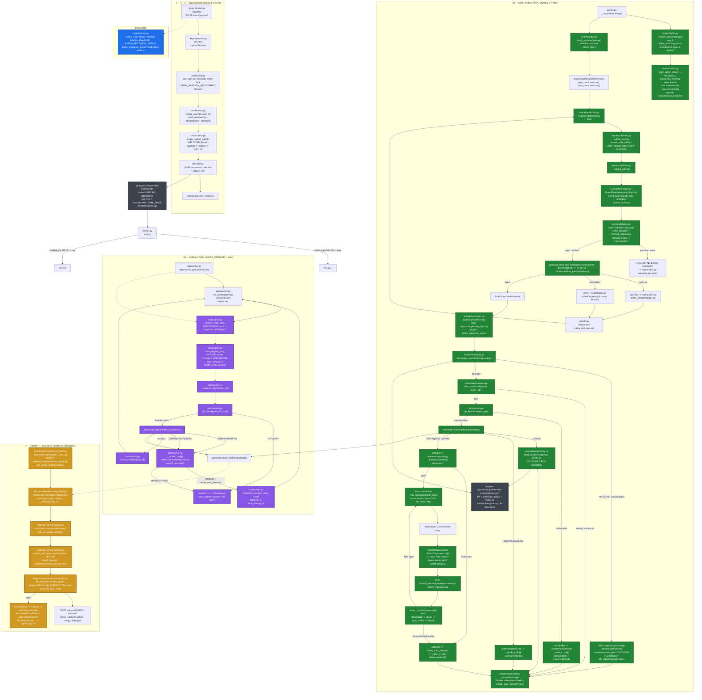

# Kafka + Welcome Email — Full Workflow

> One diagram, every function labeled. Reading path: every box shows
> `file.py::function()` so you can jump to the code. Two delivery routes
> share the **same handler**: the polling worker (`KAFKA_ENABLED=false`)
> and the Kafka publisher/consumer (`KAFKA_ENABLED=true`).

## Legend

| Color | Phase | Files |
|---|---|---|
| Blue | HTTP entry + transactional outbox | `routers/users.py`, `crud/*`, `schemas/*`, `dependencies.py` |
| Purple | Fallback polling worker | `jobs/worker.py`, `crud/outbox.py` |
| Green | Kafka publisher / consumer path | `events/*`, `worker.py` |
| Orange | Handler + email send | `jobs/handlers/*`, `external_services/*`, `templates/*` |
| Grey | Persistence | `models/*`, `alembic/*` |

## Why the invariants hold

- **One DB transaction**: the outbox row is written in the same commit as the user row, so the email job never exists without the user (`crud/users.py::create_user`).
- **At-least-once, not exactly-once**: the outbox row id is both the Kafka key *and* the `event_id`; if the process crashes after the broker acks but before `mark_completed`, staleness recovery republishes the *same* event id and the consumer dedups it via `processed_events`.
- **Durable dedup**: `processed_events` is keyed by `(consumer_group, event_id)`, `ON CONFLICT DO NOTHING` on Postgres. Dedup is per consumer group — a future second group gets its own ledger.
- **No `-retry-retry`**: retry/DLQ targets are computed from `event_type → EVENT_DOMAINS → canonical domain topic` (`events/consumer.py::_canonical_topic`), never from the message's actual topic, so a message replayed from `users.events-retry` still resolves back to `users.events-retry` (or `users.events-dlq` when exhausted).
- **Offset commit after success**: `enable_auto_commit=False`; the offset is committed only after the handler succeeded *or* the message was safely re-routed (retry/DLQ). A crash mid-handle replays the same event → dedup absorbs it.
- **Malformed messages never kill the loop**: undecodable bytes go to the DLQ via the `message.topic` fallback.
- **Single source of truth**: `events/domains.py` maps `JobType → Domain → topic`. Publisher routing, consumer subscriptions, and startup provisioning (`ensure_topics`) all derive from it — adding a domain requires only `Domain` + `EVENT_DOMAINS` + a handler, then redeploy. No per-event topic config anywhere.
- **Two delivery routes, one handler**: `WelcomeEmailHandler` accepts any `JobLike` (an `OutboxJob` from the poller or an `EventJob` from the Kafka consumer), so the two paths can never diverge in behavior.

<!-- 

Read it in one pass — 5 phases, top to bottom:
1. Entry (blue) — box A1 (register) → A2 (get_db) → A3 (get_user_by_email) → A4 (create_user) → A5 (create_outbox_job) → A6 (db.commit) → A7 (201) → lands in DB_OUTBOX.
2. Fork (green/grey) — D0 (main) → DB row → either down to poller (purple) or right into Kafka (green).
3. Kafka provisioning — K0 → K1 → K1A (creates users.events, -retry, -dlq) → K2 → K3.
4. Kafka runtime — three loops in parallel:
- Publisher: K4 → K5 → K6 → K7 (envelope) → K8 (topic) → K9 (send) → K10/K11 → K12 (sleep) → back to K4.
- Main consumer: EVT_TOPIC → K13 → K14 → dedup K16 → K18 (handler) → K20 (work) → K21 (dedup write) → K17 (commit). Failure branches: K15 (malformed→DLQ), K19 (no handler→DLQ), K22 (permanent→DLQ), K23→K24/K25 (retry/DLQ).
- Retry consumer: K26 → K26A (backoff) → K26B (same flow) → re-loop K25 or K24.
5. Email (orange) — poller P7 or Kafka K20 both → H2 (handle) → H3 → H4 (render) → H5 (send) → H7 (SMTP/NOOP), with H6 mapping errors back into JobPermanentError/JobRetryError → the retry/DLQ branches.
Start at A1, follow the arrow to D0, then choose the poller column or the Kafka column, and end at H5. That's the complete lifecycle: register → outbox → (poller | Kafka) → handler → email. -->