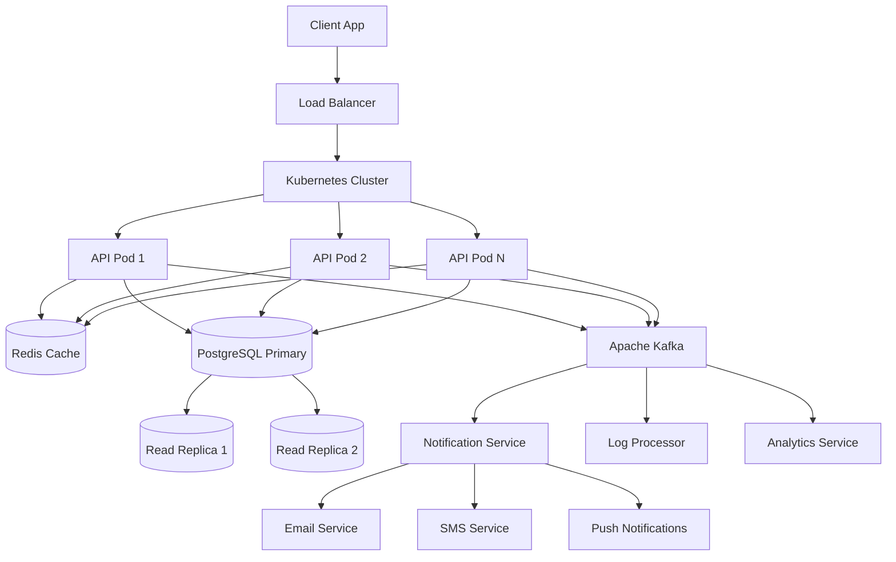
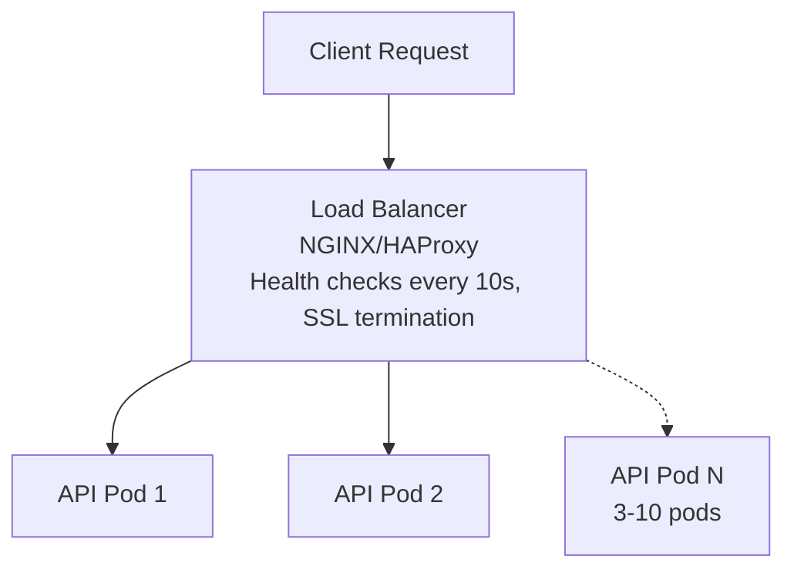
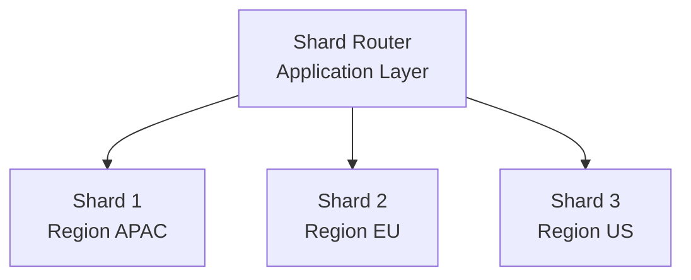
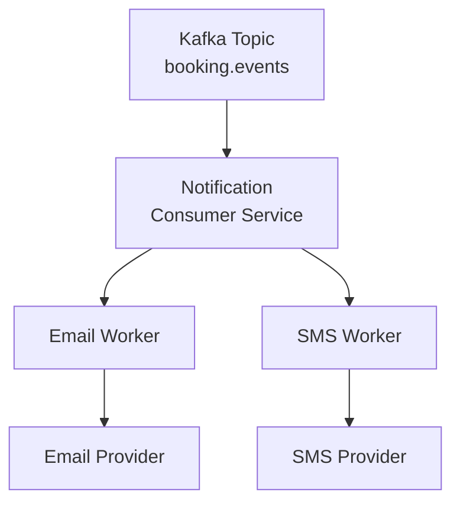
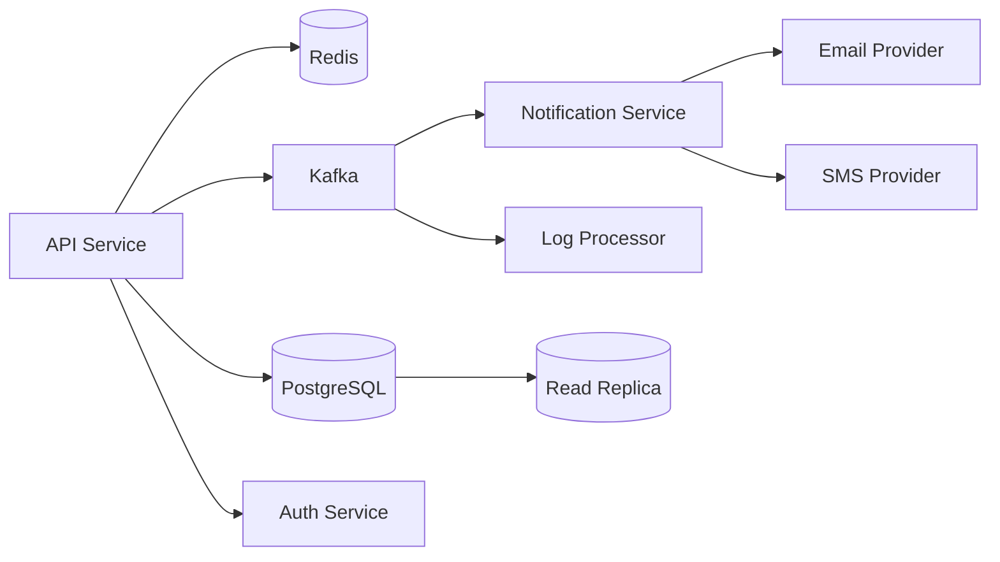

# Flight Booking System - Scalability & Performance Architecture

## Overview

This document outlines the scalability and performance architecture for the flight booking system, covering caching, messaging, container orchestration, and database sharding strategies.

---

## Architecture Components



---

## 1. Redis Caching Strategy

### Purpose
- Reduce database load for frequent queries
- Session management and token storage
- Seat availability caching (high contention)
- Rate limiting

### Cache Configuration

| Key Pattern | TTL | Data Type | Use Case |
|-------------|-----|-----------|----------|
| `flight:{id}` | 5 min | Hash | Flight details |
| `seats:{flight_id}` | 1 min | Hash | Available seats |
| `search:{origin}:{dest}:{date}` | 2 min | String (JSON) | Search results |
| `user:{id}:session` | 24 hours | String | User session |
| `user:{id}:bookings` | 10 min | List | Recent bookings |
| `booking:{id}` | 5 min | Hash | Booking details |
| `rate:{ip}` | 1 min | String (counter) | Rate limiting |

### Cache Patterns

**Read-Through Cache:**
```python
def get_flight(flight_id: str) -> dict:
    # Check cache first
    cached = redis.get(f"flight:{flight_id}")
    if cached:
        return json.loads(cached)
    
    # Cache miss - fetch from DB
    flight = db.query("SELECT * FROM flights WHERE id = %s", flight_id)
    
    # Populate cache
    redis.setex(f"flight:{flight_id}", 300, json.dumps(flight))
    return flight
```

**Write-Through Cache:**
```python
def update_seat_status(flight_id: str, seat: str, status: str):
    # Update database
    db.execute(
        "UPDATE seats SET status = %s WHERE flight_id = %s AND seat_number = %s",
        status, flight_id, seat
    )
    
    # Invalidate cache
    redis.delete(f"seats:{flight_id}")
```

**Cache Invalidation:**
- On booking confirmation → invalidate `seats:{flight_id}`
- On flight update → invalidate `flight:{id}`
- On user booking → invalidate `user:{id}:bookings`

### Redis Cluster Setup
- 3 primary nodes + 3 replicas
- Sentinel for high availability
- Automatic failover on node failure

---

## 2. Apache Kafka Messaging

### Purpose
- Asynchronous notification delivery
- Audit logging and event sourcing
- Decouple services for resilience
- Event-driven analytics

### Topic Design

| Topic | Partitions | Retention | Consumers |
|-------|------------|-----------|-----------|
| `booking.events` | 6 | 7 days | Notification, Analytics, Logger |
| `payment.events` | 6 | 7 days | Notification, Booking, Analytics |
| `flight.events` | 3 | 30 days | Notification, Cache Invalidator |
| `audit.logs` | 3 | 90 days | Log Processor, Compliance |
| `notification.email` | 3 | 24 hours | Email Worker |
| `notification.sms` | 3 | 24 hours | SMS Worker |
| `notification.push` | 3 | 24 hours | Push Worker |

### Event Schemas

**Booking Created:**
```json
{
  "event_type": "BOOKING_CREATED",
  "event_id": "uuid",
  "timestamp": "2024-01-15T10:30:00Z",
  "data": {
    "booking_id": "uuid",
    "user_id": "uuid",
    "flight_id": "uuid",
    "seat_number": "12A",
    "amount": 4500.00
  }
}
```

**Payment Completed:**
```json
{
  "event_type": "PAYMENT_COMPLETED",
  "event_id": "uuid",
  "timestamp": "2024-01-15T10:31:00Z",
  "data": {
    "payment_id": "uuid",
    "booking_id": "uuid",
    "amount": 4500.00,
    "method": "upi"
  }
}
```

### Kafka Configuration
- Replication factor: 3
- Min in-sync replicas: 2
- Acknowledgments: all (for critical events)
- Idempotent producers enabled

---

## 3. Kubernetes Orchestration

### Cluster Configuration

| Component | Replicas | Resources | Scaling |
|-----------|----------|-----------|---------|
| API Service | 3-10 | 500m CPU, 512Mi RAM | HPA (70% CPU) |
| Notification Worker | 2-5 | 250m CPU, 256Mi RAM | HPA (80% CPU) |
| Log Processor | 2-3 | 250m CPU, 256Mi RAM | HPA (70% CPU) |
| Redis | 6 (3+3) | 1G CPU, 2Gi RAM | Manual |
| Kafka | 3 | 2G CPU, 4Gi RAM | Manual |

### Deployment Architecture

```yaml
# API Service Deployment
apiVersion: apps/v1
kind: Deployment
metadata:
  name: flight-api
spec:
  replicas: 3
  selector:
    matchLabels:
      app: flight-api
  template:
    spec:
      containers:
      - name: api
        image: flight-api:latest
        resources:
          requests:
            cpu: "500m"
            memory: "512Mi"
          limits:
            cpu: "1000m"
            memory: "1Gi"
        env:
        - name: REDIS_URL
          valueFrom:
            secretKeyRef:
              name: app-secrets
              key: redis-url
        - name: KAFKA_BROKERS
          valueFrom:
            configMapKeyRef:
              name: app-config
              key: kafka-brokers
```

### Horizontal Pod Autoscaler (HPA)

```yaml
apiVersion: autoscaling/v2
kind: HorizontalPodAutoscaler
metadata:
  name: flight-api-hpa
spec:
  scaleTargetRef:
    apiVersion: apps/v1
    kind: Deployment
    name: flight-api
  minReplicas: 3
  maxReplicas: 10
  metrics:
  - type: Resource
    resource:
      name: cpu
      target:
        type: Utilization
        averageUtilization: 70
```

### Load Balancer Configuration

**Service Type:** LoadBalancer (Cloud) / MetalLB (On-prem)

**Load Balancing Algorithm:** Least Connections with Session Affinity



### Health Checks

```yaml
livenessProbe:
  httpGet:
    path: /health/live
    port: 8080
  initialDelaySeconds: 30
  periodSeconds: 10

readinessProbe:
  httpGet:
    path: /health/ready
    port: 8080
  initialDelaySeconds: 5
  periodSeconds: 5
```

---

## 4. Database Sharding Strategy

### Shard Key Selection

| Table | Shard Key | Strategy | Rationale |
|-------|-----------|----------|-----------|
| users | user_id | Hash | Even distribution |
| bookings | user_id | Hash | Co-locate with user |
| flights | region | Range | Geographic queries |
| payments | booking_id | Hash | Follows bookings |
| seats | flight_id | Hash | Co-locate with flight |

### Sharding Architecture



### Shard Implementation

**Hash-Based Sharding (users, bookings):**
```python
def get_shard(user_id: str) -> int:
    return hash(user_id) % NUM_SHARDS

def get_db_connection(user_id: str):
    shard = get_shard(user_id)
    return connections[shard]
```

**Range-Based Sharding (flights):**
```python
REGION_SHARD_MAP = {
    "DEL": 1, "BOM": 1, "BLR": 1,  # APAC
    "LHR": 2, "CDG": 2, "FRA": 2,  # EU
    "JFK": 3, "LAX": 3, "ORD": 3,  # US
}

def get_flight_shard(origin: str) -> int:
    return REGION_SHARD_MAP.get(origin, 1)
```

### Cross-Shard Queries
- Use materialized views for reporting
- Event sourcing for audit trails
- Denormalize user data to bookings for common queries

---

## 5. Notification Service Architecture

### Flow



### Notification Templates

| Event | Email | SMS | Push |
|-------|-------|-----|------|
| Booking Confirmed | ✓ | ✓ | ✓ |
| Payment Failed | ✓ | ✓ | ✓ |
| Flight Delayed | ✓ | ✓ | ✓ |
| Check-in Reminder | ✓ | - | ✓ |
| Boarding Pass | ✓ | - | ✓ |

### Retry Policy
- Max retries: 3
- Backoff: Exponential (1s, 5s, 25s)
- Dead letter queue for failed messages

---

## 6. Logging & Monitoring

### Log Architecture

```
Application → Kafka (audit.logs) → Log Processor → Storage
                                                    ↓
                                              ┌─────┴─────┐
                                              ↓           ↓
                                         ELK Stack    S3 Archive
```

### Structured Logging Format

```json
{
  "timestamp": "2024-01-15T10:30:00Z",
  "level": "INFO",
  "service": "flight-api",
  "trace_id": "abc-123",
  "span_id": "def-456",
  "user_id": "uuid",
  "event": "booking_created",
  "metadata": {
    "flight_id": "uuid",
    "amount": 4500
  }
}
```

### Monitoring Stack

| Component | Tool | Purpose |
|-----------|------|---------|
| Metrics | Prometheus | Time-series metrics |
| Visualization | Grafana | Dashboards |
| Tracing | Jaeger | Distributed tracing |
| Alerting | AlertManager | Critical alerts |
| Logs | ELK Stack | Log aggregation |

### Key Metrics

- Request latency (p50, p95, p99)
- Error rate (4xx, 5xx)
- Booking success rate
- Payment success rate
- Cache hit ratio
- Kafka consumer lag
- Database connection pool usage
- Pod restart count

---

## 7. Service Dependencies



---

## 8. Disaster Recovery

### Backup Strategy

| Component | Backup Type | Frequency | Retention |
|-----------|-------------|-----------|-----------|
| PostgreSQL | Full + WAL | Daily | 30 days |
| Redis | RDB + AOF | Every hour | 7 days |
| Kafka | Topic snapshots | Daily | 90 days |
| S3 | Versioning | Continuous | 1 year |

### Recovery Procedures

- **RTO (Recovery Time Objective):** 15 minutes
- **RPO (Recovery Point Objective):** 5 minutes

### Failover Strategy
- Database: Automatic failover to replica
- Redis: Sentinel-based failover
- Kafka: ISR-based failover
- Kubernetes: Self-healing pods
