# Flight Booking System - End-to-End Scenarios

> This document synthesizes the **Database Design** (database-design.md) and **Scalability & Performance Architecture** (scalability-performance.md) into complete service scenarios. It covers the happy path, every failure point, and the retry/recovery mechanisms.

---

## System Context

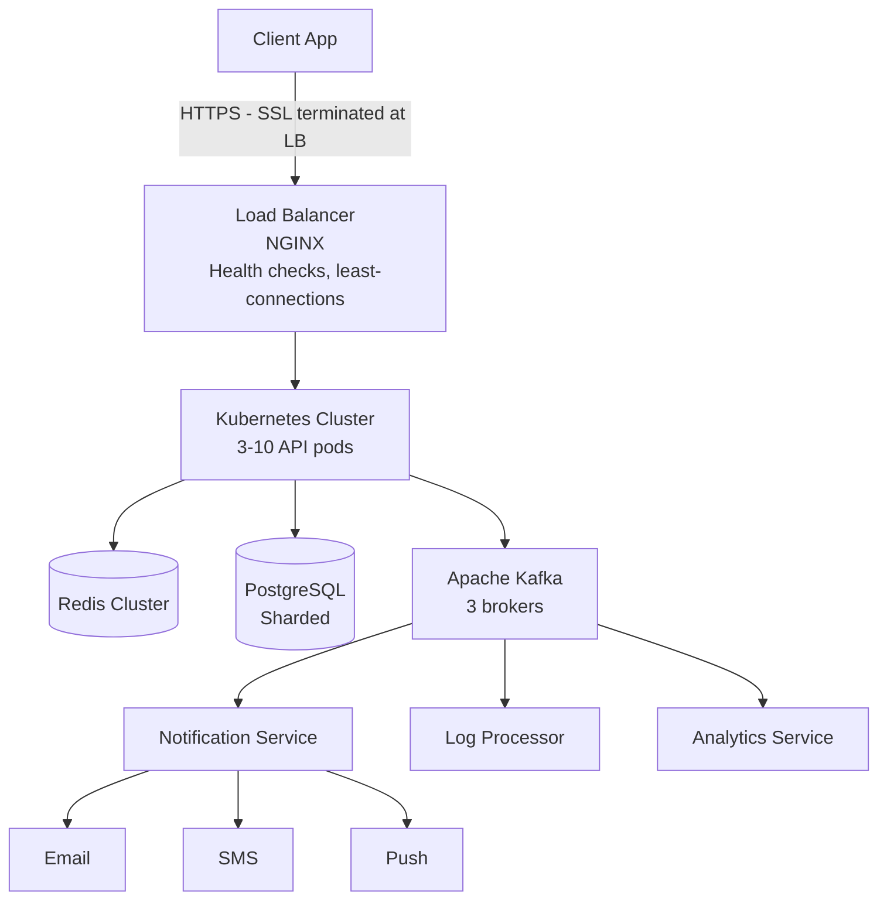

---

## SCENARIO 1: HAPPY PATH - Complete Booking Journey

### User Story
> Alice searches for flights from DEL to BOM on 15 Jan, picks a flight, books seat 12A, pays ₹4,500 via UPI, receives confirmation.

### Flow Diagram

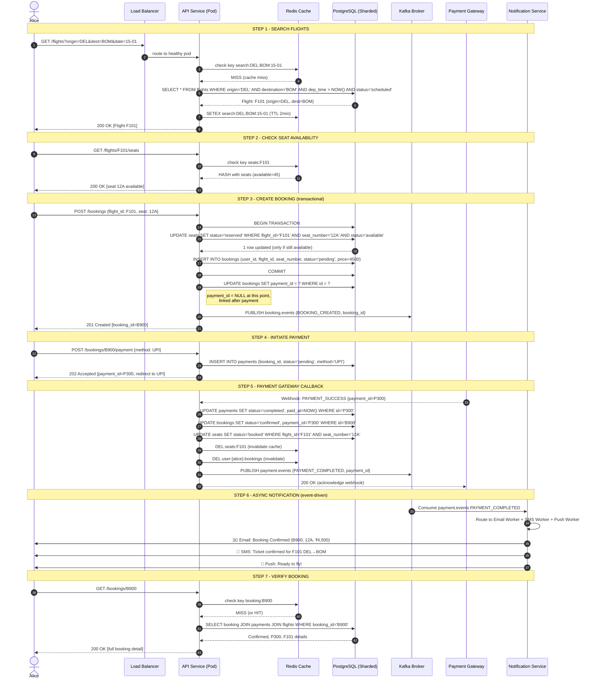

### State Transitions Across the Journey

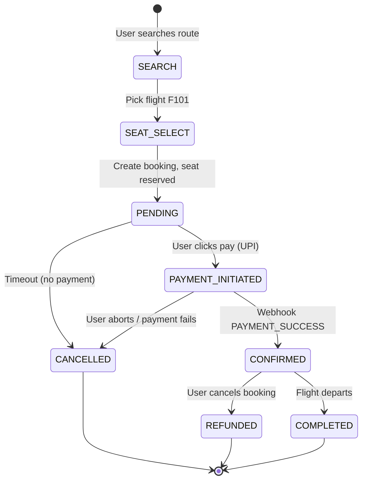

---

## SCENARIO 2: FAILURE & RETRY SCENARIOS

### 2.1 Seat Contention - "Double Booking Race"

**Scenario:** Two users try to book the last seat (12A) simultaneously.

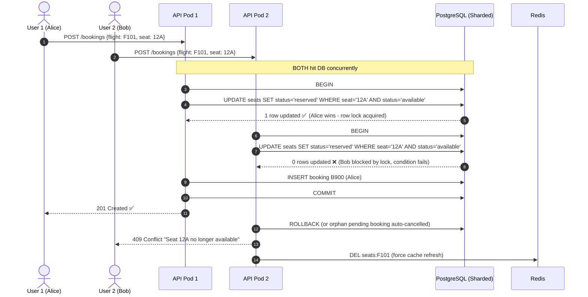

**Why it works:** The conditional `UPDATE ... WHERE status='available'` is atomic. PostgreSQL row-level locking ensures only one transaction updates the row. Bob's update affects 0 rows, so the API rejects.

**Retry path for Bob:** The API returns 409. The client UI shows alternatives:

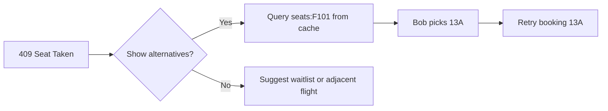

---

### 2.2 Redis Cache Failure (Cache Miss / Redis Down)

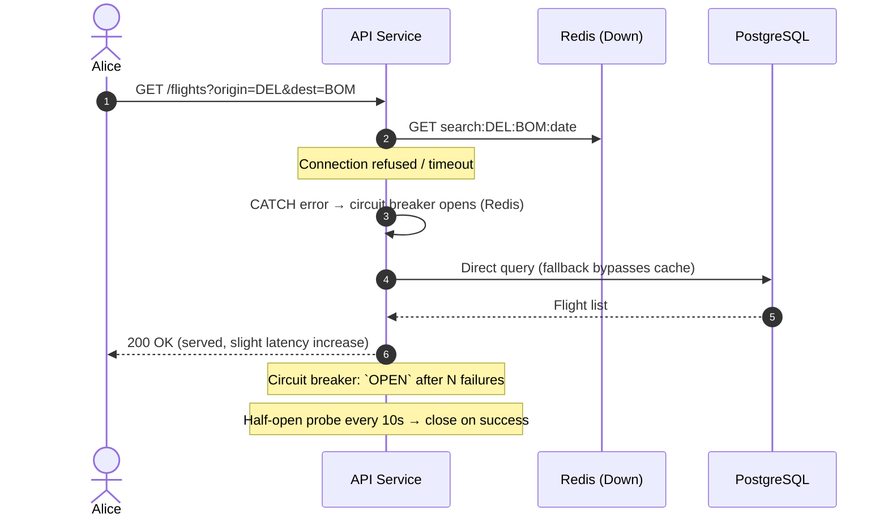

**Protections:**
- **Read fallback:** API never fails just because Redis is down; it queries DB directly.
- **Circuit breaker:** Prevents hammering a dead Redis → recovers gracefully.
- **Cache stampede / hot-key protection:** For popular routes (DEL→BOM), Redis is populated on first miss; TTL 5 min prevents all reads hitting DB.
- **Write-through invalidation:** On booking confirmation, `seats:F101` key is deleted so next read repopulates fresh data.
- If Redis is down at **write time**, cache invalidation silently fails → acceptable because TTL eventually expires.

---

### 2.3 Payment Gateway Failure - Timeout & Retry

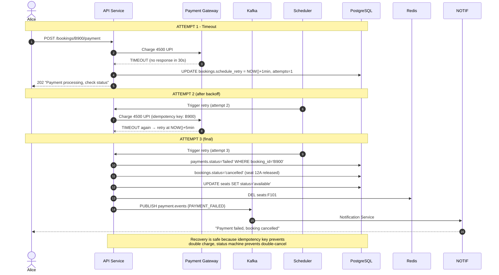

**Retry policy:**
| Attempts | Delay | Result |
|----------|-------|--------|
| 1 | immediate | 30s timeout |
| 2 | +1 min | 30s timeout |
| 3 | +5 min (exponential) | failed → booking cancelled, seat released |
| DLQ | — | Marked for manual review, alert to ops team |

**Idempotency protection:** Payment gateway call carries `Idempotency-Key: B900`. Even if retries overlap, the gateway returns the same transaction for the same key → no double charge.

---

### 2.4 Kafka Failure - Event Buffering & Delivery Guarantee

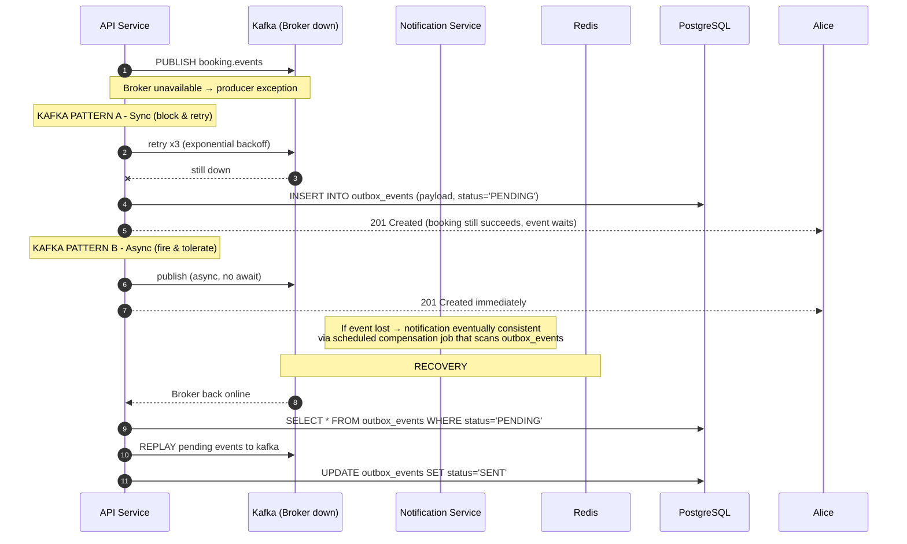

**Key guarantees (from scalability-performance.md):**
- Replication factor 3, min in-sync replicas 2
- Acks=all for critical events (`payment.events`, `booking.events`)
- **Outbox pattern** ensures no event is lost when Kafka is down: events are written to DB first, then a relay publishes them.
- Consumer lag is monitored via Prometheus → alert when consumers fall behind.

---

### 2.5 Database / Shard Failure

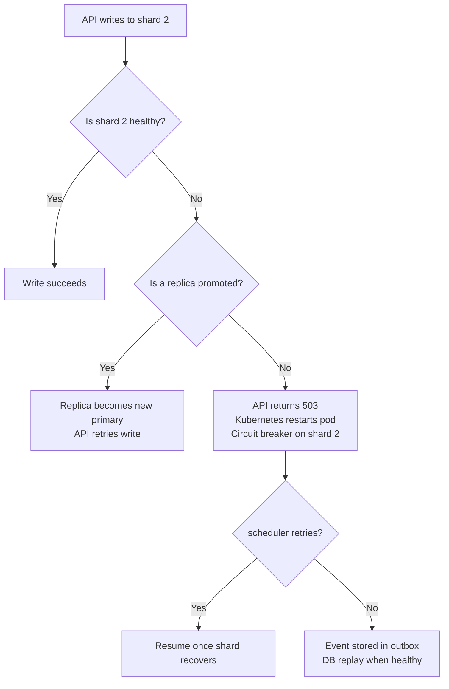

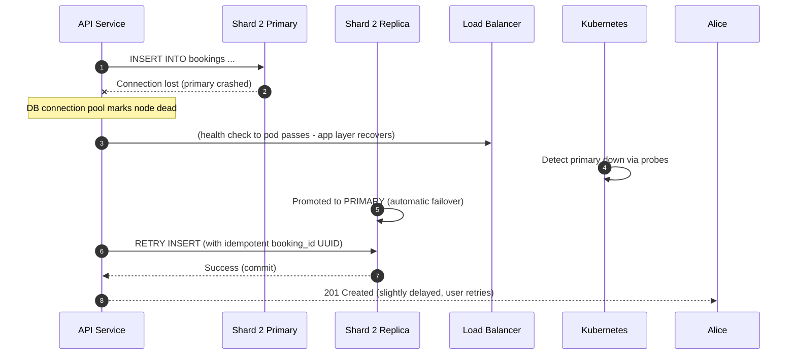

**Protections:**
- Write requests use UUID as PRIMARY KEY → idempotent, safe to retry.
- PostgreSQL fails over to replica automatically (RTO 15 min, RPO 5 min target).
- Shard routing is at the app layer → does not depend on DB topology changes.
- If a shard is down, that region's traffic still works (flights distributed by region).

---

### 2.6 Notification Delivery Failure

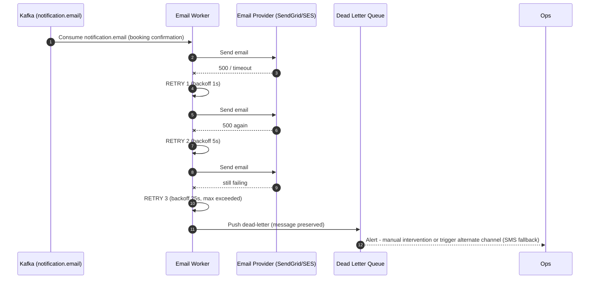

**Multi-channel fallback:**
| Channel | On Success | On Failure |
|---------|------------|------------|
| Email | Confirm sent | Retry x3 → if fail, try SMS |
| SMS | Confirm sent | Retry x3 → if fail, alert + DLQ |
| Push | Confirm sent | Best-effort (no retry, push is disposable) |

**User notification guarantee:** Even if all channels fail at delivery, the user can always check `GET /bookings/{id}` in-app, which reads from DB (source of truth). Notifications are nice-to-have; booking state is guaranteed.

---

### 2.7 Kubernetes / Load Balancer Failure

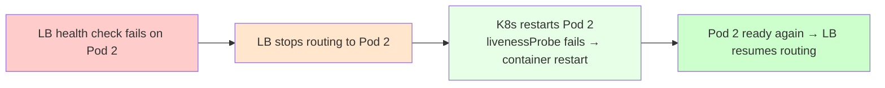

**Detailed sequence:**
1. Pod 2 becomes unhealthy (memory leak, hung request).
2. Liveness probe (`/health/live`) fails 3 times → container killed & restarted by kubelet.
3. Readiness probe (`/health/ready`) fails → pod removed from Service endpoints → LB stops sending traffic.
4. Container restarts; on restart, `readinessProbe` passes → pod re-added to LB rotation.
5. **HPA** sees elevated CPU across cluster → scales 3 → 10 pods for surge load.

**Session affinity note:** If a user was mid-payment on Pod 2 and it dies, the user's request fails at LB layer → client retries → lands on Pod 3 → because booking/payment state is in DB, **retry succeeds** without loss.

---

## SCENARIO 3: Retry & Recovery Matrix (Complete Reference)

| # | Component Failure | User Impact | Retry Mechanism | Recovery | Guarantee |
|---|-------------------|-------------|-----------------|----------|-----------|
| 1 | Seat taken (concurrent booking) | 409 error | User re-selects seat | Atomic conditional UPDATE, row locks | No double-booking |
| 2 | Redis down | Slight latency | API falls back to DB | Circuit breaker + TTL cache | Read availability |
| 3 | Payment timeout | Transaction pending | Scheduler retries (1m, 5m) × 3 → cancel | Idempotency key prevents double charge | Eventually consistent |
| 4 | Kafka down | Notification delayed | Outbox pattern in DB | Relay replays pending events | No event loss |
| 5 | DB shard down | 503 on region | K8s restart + replica failover | Auto-promotion, idempotent UUID retry | RTO 15m / RPO 5m |
| 6 | Email/SMS provider down | User misses notification | Exponential backoff ×3 → DLQ | SMS fallback, in-app booking status | Best-effort notify, DB is truth |
| 7 | Pod killed | Temporary timeout | Client retries via LB | Liveness/readiness probes, HPA scale-out | Stateless API, state in DB |
| 8 | Load balancer down | All traffic lost | DNS failover to secondary LB | Health checks + multi-AZ | High availability |

---

## SCENARIO 4: Full Lifecycle State Change (Liked by Design)

```
User Search      →  Flight Selected   →  Booking PENDING   →  Payment PENDING
     │                    │                    │                   │
     v                    v                    v                   v
 ┌────────┐        ┌────────────┐      ┌────────────┐      ┌───────────────┐
 │ Flight │        │ Seat       │      │ Booking    │      │ Payment       │
 │ list   │        │ RESERVED   │      │ (pending)  │      │ (pending)     │
 └────────┘        └────────────┘      └────────────┘      └───────────────┘
        ───────────────────────────────────────────────────────────┘
                                   │
                        Webhook PAYMENT_SUCCESS
                                   │
                                   v
                    ┌─────────────────────────────┐
                    │  Booking CONFIRMED          │
                    │  Seat BOOKED                │
                    │  Payment COMPLETED          │
                    │  Cache Invalidated          │
                    │  Kafka → Notification       │
                    └─────────────────────────────┘
                                   │
                   ┌───────────────┴───────────────┐
                   │                               │
                   v                               v
        ┌──────────────────┐           ┌──────────────────┐
        │ Flight departs   │           │ User cancels     │
        │ Booking COMPLETED│           │ Booking CANCELLED│
        │                  │           │ Seat AVAILABLE   │
        │                  │           │ Payment REFUNDED │
        └──────────────────┘           └──────────────────┘
```

---

## SCENARIO 5: High Concurrency - Flash Sale (e.g., 1000 users, 1 flight)

**Problem:** Flight F200 has 80 economy seats. 1,000 users hammer book simultaneously.

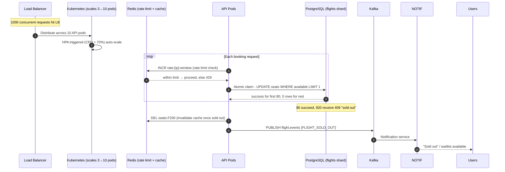

> **Note:** SQL is kept outside the diagram. Mermaid message text renders plain-flow only. The actual seat-claim statement:
>
> ```sql
> BEGIN;
> UPDATE seats SET status='reserved'
> WHERE status='available'   -- 0 rows = seat gone, 1 row = claimed
> LIMIT 1;
> COMMIT;
> ```

**Scaling protections implemented:**
- **Rate limiting** in Redis (`rate:{ip}`) prevents single-user flooding.
- **Opt-out of caching** for seat check during flash sale (or 1s TTL) to avoid cache stampede.
- **Conditional UPDATE** as seat-slot claim is atomic; PostgreSQL queues row locks naturally.
- **HPA** scales API pods 3→10; DB sharding spreads load across region shards.

---

## SCENARIO 6: Cross-Shard Query Challenge

**Scenario:** An admin/reporting query `SELECT region, COUNT(*) FROM bookings GROUP BY region` spans all shards.

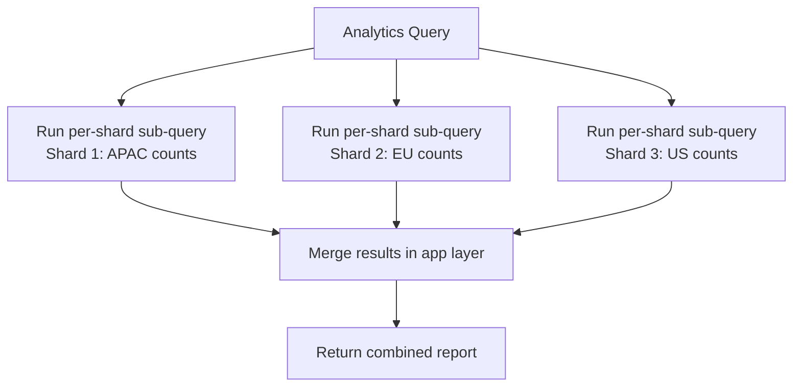

**Preferred approach (documented in scalability-performance.md):**
- **Denormalize** booking rows with `user_region` column copied at write-time → single-shard reads for user-scoped queries.
- **Materialized views** refreshed from Kafka `audit.logs` for analytics (read-only replica attached to analytics consumer group).
- **Reference tables** (airlines) replicated across all shards to avoid cross-shard joins.
- Use Kafka events (`booking.events`) → data warehouse for complex reporting instead of querying live shards.

---

## Operational Alerting (Alerts that trigger ops intervention)

| Alert | Metric | Action |
|-------|--------|--------|
| Booking success rate < 99% | Prometheus counter | Pager, investigate DB lock contention |
| Payment success rate < 90% | Prometheus counter | Pager, check payment gateway webhooks |
| Kafka consumer lag > 1000 | consumer_lag metric | Check Notification/Logger workers |
| Cache hit ratio < 70% | redis cache hit ratio | Review TTL and key design |
| p99 latency > 2s | request duration histogram | Scale pods, check DB slow queries |
| Shard down > 5 min | shard health probe | Restore from replica / backup recovery |
| DLQ depth > 100 | dead letter count | Manual replay or notification audit |

---

## Key Design Principles (Summary)

1. **DB is the source of truth** — always consistent; Redis/Kafka are accelerators, never authoritative for critical data.
2. **Events are never lost** — Kafka acks=all + outbox pattern in DB for critical events.
3. **Seat booking race is solved at the DB level** — atomic conditional UPDATE, not app-level locks.
4. **Stateless API + stateful DB/queue** — any pod can die; retries land anywhere and still succeed.
5. **Idempotency everywhere** — UUID PKs, idempotency keys on payments, outbox event replays safe.
6. **Notifications are best-effort; booking state is guaranteed** — user can always query in-app.
7. **Failures are staggered, not cascading** — circuit breakers, backoff, DLQs, fallback channels.