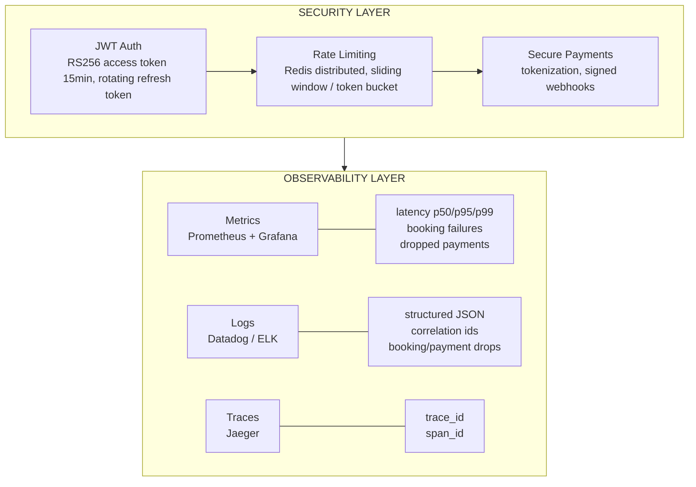
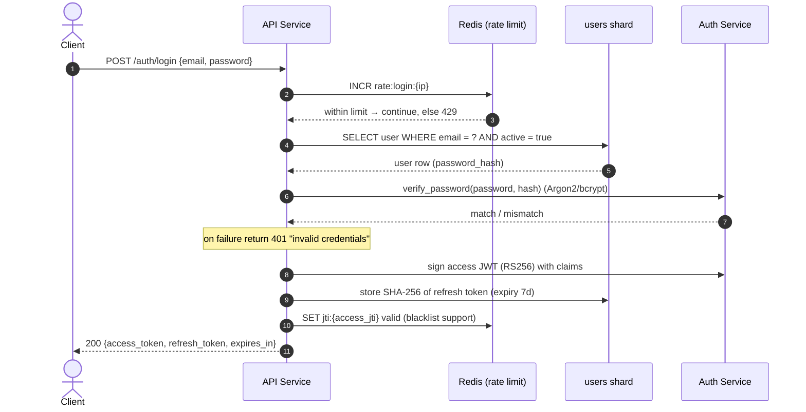
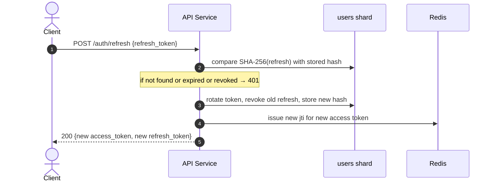
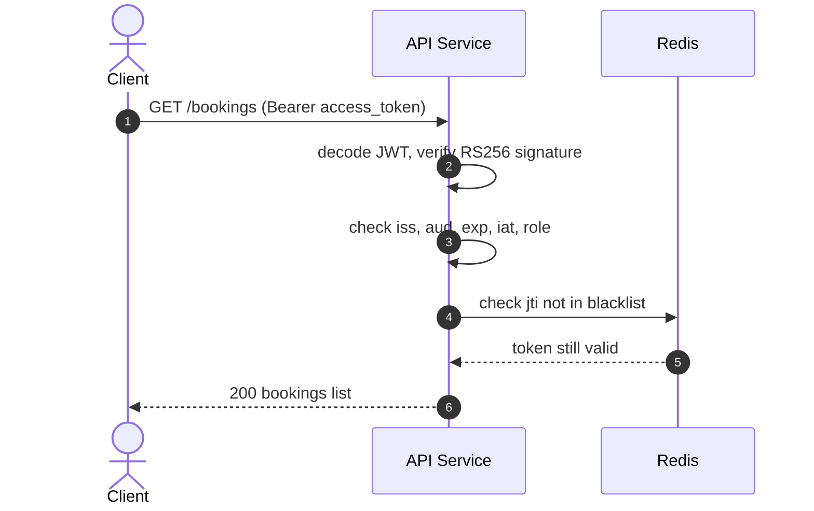
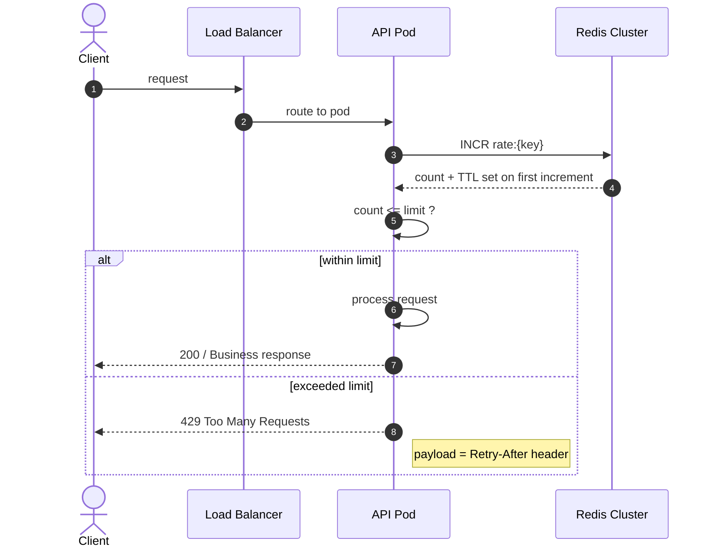
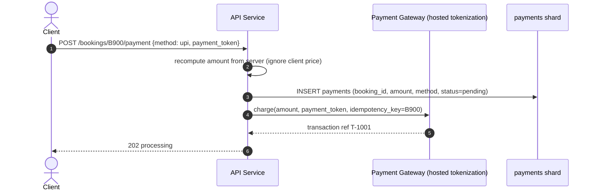
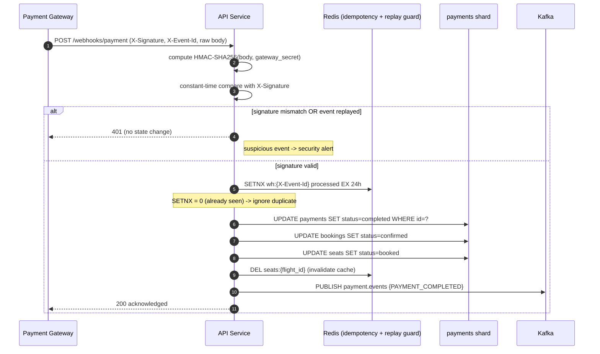
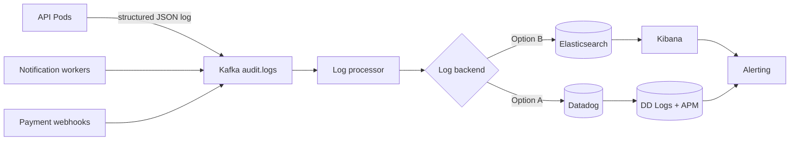
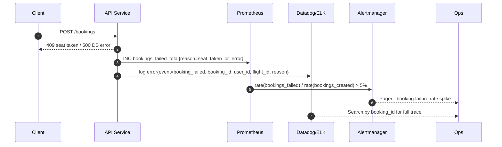
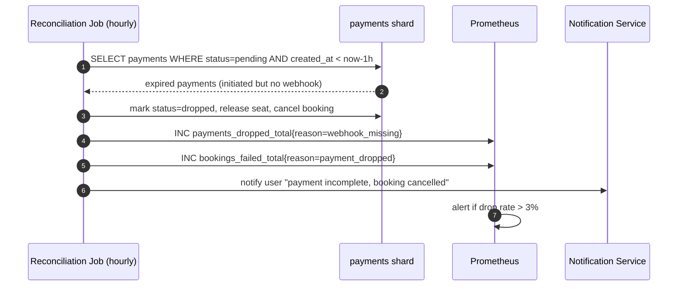

# Flight Booking System - Security, Monitoring & Logging

> This document defines the security controls (authentication, rate limiting, secure payments) and the observability stack (Prometheus + Grafana metrics, Datadog/ELK logging) for the flight booking system. It complements database-design.md, scalability-performance.md and scenarios.md.

---

## OVERVIEW



---

# PART A - SECURITY

## A1. JWT Authentication

### 1.1 Token Design

| Token         | Type            | Lifetime | Storage            | Notes                                                 |
| ------------- | --------------- | -------- | ------------------ | ----------------------------------------------------- |
| Access Token  | JWT (RS256)     | 15 min   | Client memory only | Sent on every API call via `Authorization: Bearer`    |
| Refresh Token | Opaque (random) | 7 days   | Hashed in DB       | Stored HttpOnly+Secure cookie / secure device storage |

**Access token JWT claims:**

```json
{
  "iss": "flight-booking-api",
  "aud": "flight-booking-client",
  "sub": "user-uuid",
  "role": "user",
  "jti": "unique-token-id",
  "iat": 1705300000,
  "exp": 1705300900
}
```

### 1.2 Login & Token Issue Flow



### 1.3 Token Refresh & Rotation



### 1.4 Every Authenticated Request



### 1.5 Security Practices

- **Hashing:** passwords with Argon2id / bcrypt (cost tuned) — never reversible hash.
- **Refresh tokens stored only as SHA-256 digests** — DB leak does not expose usable tokens.
- **Client side:**
  - Web: refresh token in `HttpOnly + Secure + SameSite=Strict` cookie → XSS cannot read it.
  - Access token in memory only — never in `localStorage` (XSS-exfiltrates).
  - Mobile: store in OS secure enclave / Keychain.
- **Never log tokens, passwords, or reset links.**
- **Rotation & reuse detection:** a replayed refresh token revokes the whole token family + alert.
- **Logout / password change:** add `jti` to Redis blacklist for immediate revocation (JWT is otherwise stateless).
- **Secret management:** signing keys in KMS/Vault, rotated on schedule; RS256 keypair per environment.
- **Account enumeration:** return the same generic 401 for "invalid email" and "invalid password".

### 1.6 Auth Failure Matrix

| Failure                                  | Response            | Action                             |
| ---------------------------------------- | ------------------- | ---------------------------------- |
| Expired access token                     | 401                 | Client uses refresh token silently |
| Invalid signature / tampered token       | 401                 | Reject, log suspicious event       |
| Blacklisted jti (logout/password change) | 401                 | Reject until new login             |
| Reused/rotated refresh token             | 401 + revoke family | Alert security team                |
| Brute force on login                     | 429 after threshold | Lock + require captcha             |

---

## A2. Rate Limiting

### 2.1 Strategy

Distributed rate limiting via **Redis cluster** (single shared counter for all API pods).



### 2.2 Limits by Endpoint

| Endpoint                      | Key        | Limit     | Window | Strategy                        |
| ----------------------------- | ---------- | --------- | ------ | ------------------------------- |
| `POST /auth/login`            | IP + email | 5         | 1 min  | Fixed window (anti brute-force) |
| `POST /auth/refresh`          | user id    | 20        | 1 min  | Fixed window                    |
| `GET /flights/search`         | IP         | 60        | 1 min  | Sliding window (burst safe)     |
| `POST /bookings`              | user id    | 10        | 1 min  | Token bucket                    |
| `POST /bookings/{id}/payment` | user id    | 10        | 1 min  | Token bucket                    |
| `POST /webhooks/payment`      | gateway IP | whitelist | -      | Allowlist, no limit             |

**Keying rules:**

- Authenticated endpoints → keyed by `user_id` (immune to IP behind NAT, survives pod hops).
- Pre-auth endpoints (login) → keyed by `ip` (from trusted `X-Forwarded-For` set only by the LB).

**Redis implementation (atomic):**

```
INCR rate:{key}
EXPIRE rate:{key} window    # only set on first INCR (count == 1)
```

### 2.3 Response Contract

```http
HTTP/1.1 429 Too Many Requests
X-RateLimit-Limit: 60
X-RateLimit-Remaining: 0
X-RateLimit-Reset: 1705300100
Retry-After: 45
```

### 2.4 Anti-Abuse Extras

- **Login:** combine per-IP + per-email counting; exponential lockout after N failures.
- **Distributed correctness:** single Redis cluster is the counter source of truth; no per-pod counters.
- **Bypass risks:** never trust client-declared IPs; only the LB stamps the real IP.
- **Monitoring tie-in:** every 429 increments `http_requests_total{status="429", endpoint}` → Grafana alert on abuse spikes.

---

## A3. Secure Payments

### 3.1 PCI-DSS Principles

| Control                   | Implementation                                                                                                   |
| ------------------------- | ---------------------------------------------------------------------------------------------------------------- |
| **Never store card data** | We store only `payment_token`, amount, method, status — never PAN/CVV                                            |
| **Card capture**          | Gateway-hosted fields / tokenized card elements (Stripe/Razorpay/cardinal-style) — card never touches our server |
| **3DS / SCA**             | Route high-risk payments through 3-D Secure before capture                                                       |
| **Encryption in transit** | TLS 1.2+ enforced on every endpoint and webhook                                                                  |
| **Encryption at rest**    | AES-256 for DB, keys in KMS/Vault                                                                                |
| **Log redaction**         | Mask PAN (e.g. `411111******1111`), never log CVV/expiry                                                         |

### 3.2 Payment Initiation (tokenized)



### 3.3 Webhook Signature Verification

Gateway never trusts our app to announce payment completion; it sends a signed webhook.



### 3.4 Webhook Failure Handling

| Condition                                  | Action                                                |
| ------------------------------------------ | ----------------------------------------------------- |
| Signature mismatch                         | Reject 401, do NOT change state, security alert       |
| Duplicate event (network retry)            | `SETNX` replay guard → idempotent, no double link     |
| Payment declined                           | Mark `failed`, release seat, notify user, Kafka event |
| Amount mismatch                            | Reject + alert (possible tampering)                   |
| Webhook missing (payment pending too long) | **Reconciliation job** marks it `dropped` (see B3)    |

### 3.5 Idempotency & Trust

- **Idempotency-Key** on charge calls prevents double charging across network retries.
- **Server recomputes price** — client-supplied amounts are never trusted.
- **Rotation of gateway secrets** with versioned `key id` in the signature header.
- **Refunds** travel the same signed-webhook path; never auto-refund from an unverified caller.

---

# PART B - MONITORING & LOGGING

## B1. Metrics with Prometheus + Grafana

### 1.1 Metric Inventory

**Latency - HTTP (RED method):**
| Metric | Type | Labels | Purpose |
|--------|------|--------|---------|
| `http_request_duration_seconds` | Histogram | `method`, `endpoint`, `status` | p50 / p95 / p99 latency |
| `http_requests_total` | Counter | `method`, `endpoint`, `status` | Request rate & error rate |
| `http_errors_total` | Counter | `endpoint`, `code` | 4xx / 5xx breakdown |

**Business - Bookings:**
| Metric | Type | Purpose |
|--------|------|---------|
| `bookings_created_total` | Counter | All booking attempts |
| `bookings_confirmed_total` | Counter | Successfully paid bookings |
| `bookings_cancelled_total` | Counter | Cancelled |
| `bookings_failed_total` | Counter + `reason` label | Seat taken, timeout, transaction error |
| `booking_processing_duration_seconds` | Histogram | Booking endpoint latency |

**Business - Payments:**
| Metric | Type | Purpose |
|--------|------|---------|
| `payments_initiated_total` | Counter | Payment attempts |
| `payments_completed_total` | Counter | Successful charges |
| `payments_failed_total` | Counter + `reason` label | Declined, timeout, insufficient funds |
| `payments_dropped_total` | Counter + `reason` label | Initiated but never completed (reconciliation) |
| `webhook_received_total` / `webhook_failed_total` | Counter | Gateway callback health |

**Infrastructure (USE method):**
| Metric | Purpose |
|--------|---------|
| `kafka_consumer_lag` | Notification/logger workers keeping up |
| `kafka_topic_partition_current_offset` | Event throughput |
| `dead_letter_queue_depth` | Undeliverable messages per topic |
| `cache_hit_ratio` (hits/hits+misses) | Redis effectiveness |
| `pg_connection_count`, `pg_transaction_duration` | DB saturation |
| `pod_restarts_total`, `node_cpu`, `node_memory` | K8s health |

### 1.2 Key PromQL Queries

```promql
# p99 HTTP latency (last 5 min)
histogram_quantile(
  0.99,
  sum by (le) (rate(http_request_duration_seconds_bucket[5m]))
)

# Booking failure rate
rate(bookings_failed_total[5m]) /
  rate(bookings_created_total[5m])

# Dropped payment rate
rate(payments_dropped_total[5m]) / rate(payments_initiated_total[5m])

# Kafka consumer lag per consumer group
sum(kafka_consumer_lag) by (consumer_group, topic)

# DLQ depth
max(dead_letter_queue_depth) by (topic)
```

### 1.3 Dashboards (Grafana)

| Dashboard          | Panels                                                                  |
| ------------------ | ----------------------------------------------------------------------- |
| **Overview**       | RPS, error %, p95/p99 latency, active pods                              |
| **Booking Funnel** | created → confirmed → completed (bar/flow); failed + cancelled counters |
| **Payment Health** | completed vs failed vs dropped; webhook latency; DLQ depth              |
| **Latency**        | p50/p95/p99 per endpoint × status heatmap                               |
| **Infra**          | CPU/memory per pod, Redis hit ratio, DB connections, Kafka lag          |

### 1.4 Alert Rules (sample)

```yaml
- alert: BookingFailureRateHigh
  expr: rate(bookings_failed_total[5m]) / rate(bookings_created_total[5m]) > 0.05
  for: 5m
  labels: { severity: critical }

- alert: PaymentDropRateHigh
  expr: rate(payments_dropped_total[5m]) / rate(payments_initiated_total[5m]) > 0.03
  for: 10m
  labels: { severity: critical }

- alert: HighLatency
  expr: histogram_quantile(0.99, sum(rate(http_request_duration_seconds_bucket[5m])) by (le)) > 2
  for: 5m
  labels: { severity: warning }

- alert: KafkaConsumerLag
  expr: sum(kafka_consumer_lag) by (consumer_group) > 1000
  for: 5m
  labels: { severity: warning }

- alert: DeadLetterQueueGrowing
  expr: max(dead_letter_queue_depth) by (topic) > 100
  for: 5m
  labels: { severity: critical }
```

---

## B2. Log Aggregation - Datadog / ELK

### 2.1 Pipeline



**Verdict:** use **Datadog** for managed Gradika-ready log+metric+APM in one place, or **ELK** for self-hosted/air-gapped control. The ingestion contract (below) is identical for both.

### 2.2 Structured Log Contract

```json
{
  "timestamp": "2024-01-15T10:30:00Z",
  "level": "info",
  "service": "flight-api",
  "environment": "production",
  "trace_id": "tr_8f3a2c",
  "span_id": "sp_01b92d",
  "tenant": "ap-api-1",
  "event": "payment_completed",
  "correlation": {
    "user_id": "u_123",
    "booking_id": "b_900",
    "payment_id": "p_300",
    "flight_id": "f_101",
    "request_id": "req_x"
  },
  "duration_ms": 240,
  "detail": {}
}
```

### 2.3 Log Levels

| Level   | Meaning                      | Examples                                              |
| ------- | ---------------------------- | ----------------------------------------------------- |
| `error` | Customer-impacting failure   | booking failed, payment dropped, webhook reject       |
| `warn`  | Potential issue, needs watch | retry limit reached, cache miss storm, webhook replay |
| `info`  | Major business event         | booking confirmed, payment completed, user.login      |
| `debug` | Troubleshooting              | request params (never secrets), cache ops             |

### 2.4 Correlation & Tracing

- Every request gets `request_id` (LB-level) → `trace_id` + `span_id` propagated down the call graph (Jaeger / DD APM).
- Every log carries `user_id`, `booking_id`, `payment_id` so a single support ticket can join **log + metric + trace**.
- Frontend sends `request_id` in `X-Request-Id` header, surfaced in error payloads → users' bug reports find their exact trace.

### 2.5 Log Hygiene (never log)

- Passwords, JWT/refresh tokens, reset tokens
- Full card PAN, CVV, expiry, any cardholder data
- API/gateway secrets and signature keys
- Personal data not required by purpose (reduces GDPR/compliance blast radius)

---

## B3. Tracking the Two Critical Failures

### 3.1 Failed Bookings



### 3.2 Dropped Payments (initiated, never completed)



**Why this matters:** a missing webhook (gateway never confirmed) would otherwise leave a user "booked" forever with a seat held. The reconciliation job converts silent hangs into a monitored `dropped` metric + user notification + auto-cancel.

### 3.3 Failure → Metric → Log → Alert Mapping

| Symptom                   | Metric                          | Log event          | Alert                  |
| ------------------------- | ------------------------------- | ------------------ | ---------------------- |
| Booking rejected          | `bookings_failed_total`         | `booking_failed`   | rate > 5% → critical   |
| Payment declined          | `payments_failed_total{reason}` | `payment_failed`   | rate > 5% → warning    |
| Payment never completed   | `payments_dropped_total`        | `payment_dropped`  | rate > 3% → critical   |
| Webhook signature invalid | `webhook_failed_total`          | `webhook_rejected` | > 0 in 5m → security   |
| Slow API                  | `http_request_duration_seconds` | `slow_request`     | p99 > 2s → warning     |
| Kafka falling behind      | `kafka_consumer_lag`            | `consumer_lag`     | lag > 1000 → warning   |
| Undeliverable messages    | `dead_letter_queue_depth`       | `dlq_message`      | depth > 100 → critical |

---

## PART C - OPERATIONAL RUNBOOK (summary)

| Incident                | First Signal                                     | First Look                                | Recovery                                                                     |
| ----------------------- | ------------------------------------------------ | ----------------------------------------- | ---------------------------------------------------------------------------- |
| Login brute force       | 429 spike on `/auth/login`                       | Grafana rate panel, DD log `login_failed` | IP lockout, captcha, notify on abuse via Redis                               |
| Seat contention storm   | `bookings_failed_total{reason=seat_taken}` spike | Panel + logs                              | Locks are atomic by design; verify no deadlocks in `pg_transaction_duration` |
| Payment timeout cluster | `payments_failed_total` spike                    | Payment health dashboard                  | Check gateway health, webhook delivery, restart consumers                    |
| Dropped payments        | `payments_dropped_total` rising                  | Reconciliation job logs                   | Verify with gateway via transaction refs, notify users                       |
| K8s scale scare         | CPU > 70%, latency p99 rising                    | K8s + latency dashboards                  | HPA already scales; investigate slow DB queries next                         |
| Security event          | `webhook_failed_total`, auth anomalies           | DD security view                          | Rotate secrets, revoke token family, review audit.logs                       |

uv is a fast Python package & project manager (written in Rust, by the Astral team — the same folks behind Ruff). It's a drop-in replacement for tools like pip + venv + poetry: it creates a venv, manages dependencies in pyproject.toml, and resolves/installs packages much faster than pip.
You can't run it simply because it isn't installed — uv isn't part of Python; it's a separate binary. Your shell looked through PATH, found nothing named uv, and printed "command not found."
You have options:

1.  sudo snap install astral-uv (what the error suggests)
2.  curl -LsSf https://astral.sh/uv/install.sh | sh (official installer)
3.  pip install uv (if you already have a Python environment)
    Want me to install it and re-run uv init . for you?
    ▣ Build · Big Pickle · 7.4s
    nay@nay:~/projects/fast/backend$ uv init .
    Command 'uv' not found, but can be installed with:
    sudo snap install astral-uv
    nay@nay:~/projects/fast/backend$ sudo snap install astral-uv
    [sudo: authenticate] Password:  
    error: This revision of snap "astral-uv" was published using classic confinement and thus may
    perform arbitrary system changes outside of the security sandbox that snaps are usually
    confined to, which may put your system at risk.

           If you understand and want to proceed repeat the command including --classic. ??

- Thought: 1.1s
  That's a safety prompt from Ubuntu's snap package manager, not an error.
  Snaps are normally sandboxed — they can only touch their own isolated filesystem. But uv (like most dev CLI tools) needs to write to your home directory, create venvs, symlink binaries, read your whole filesystem into PATH, etc. — so the publisher requested "classic confinement", meaning no sandbox at all: it runs with the same system access as any normally-installed program.
  Snap is just warning you: "this app can do anything on your system, not limited to a sandbox." That's expected and considered acceptable for trusted dev tools — the alternative (official installer) does exactly the same by nature.
  To proceed, you must opt-in explicitly:
  sudo snap install astral-uv --classic
  It's safe to accept here since uv is a widely-used, trusted tool from Astral. Alternatively, the official installer avoids the snap entirely:
  curl -LsSf https://astral.sh/uv/install.sh | sh
  Want me to run one of these for you and then uv init .?
